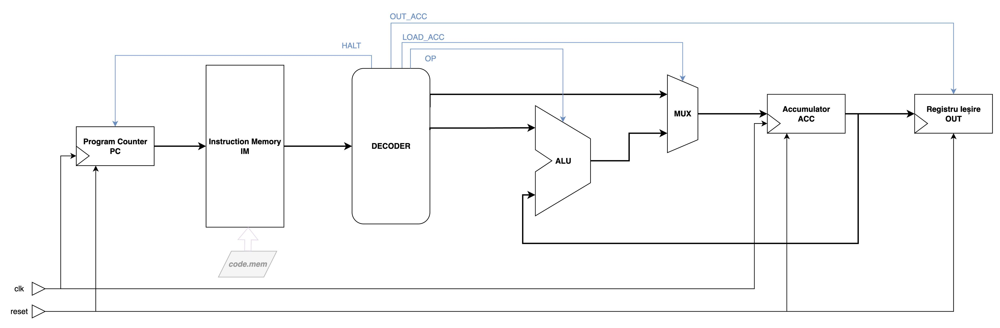
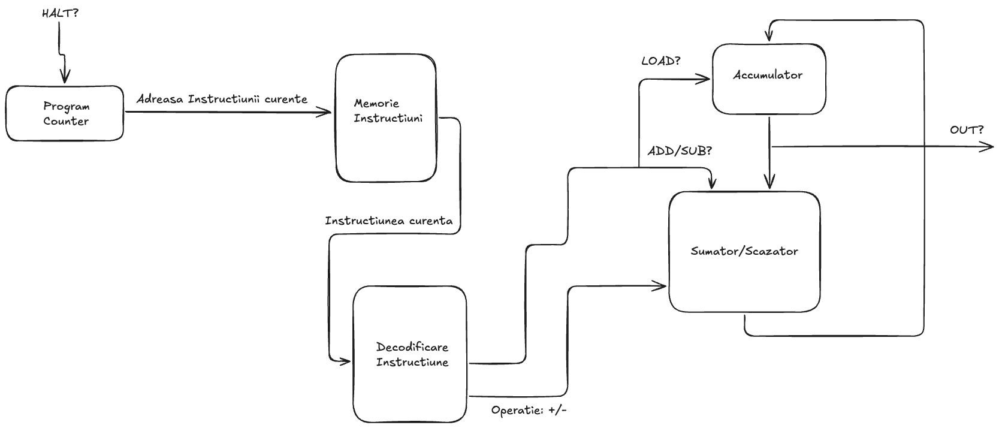
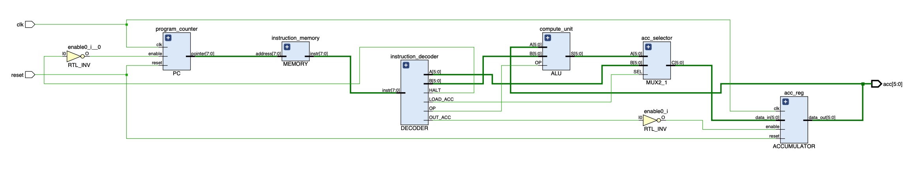
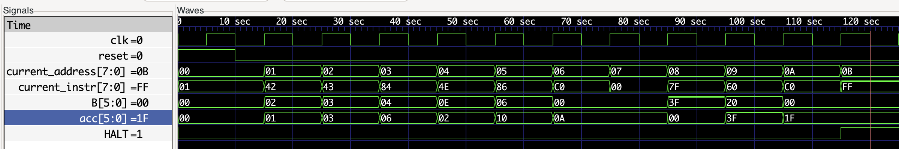
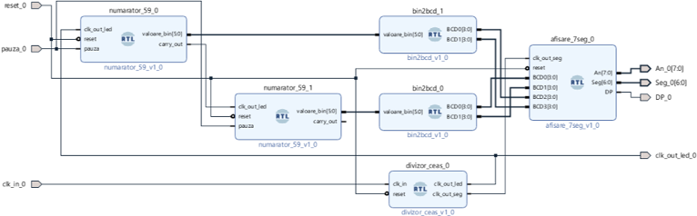
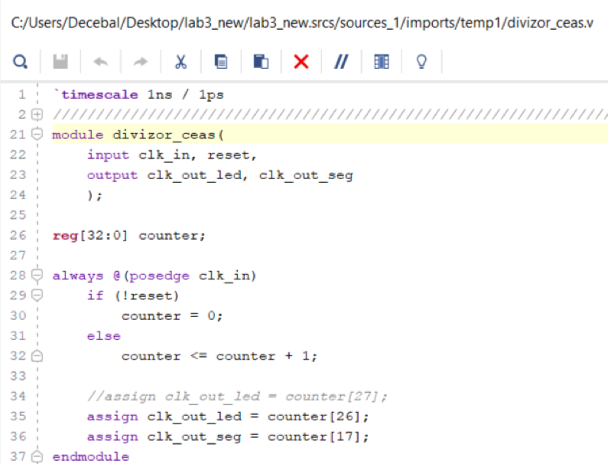
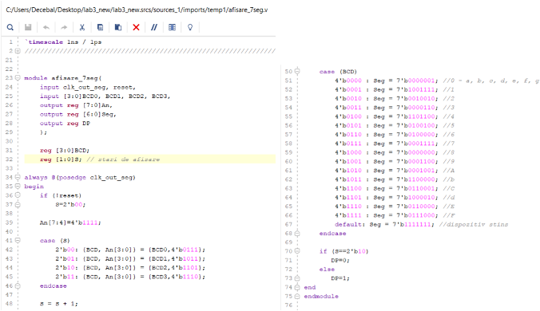
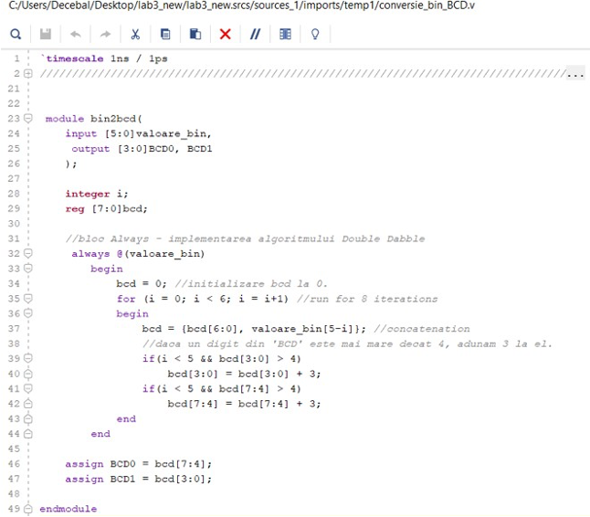

# Simple-As-Possible 1 - Cel mai simplu microprocesor posibil

Ca si parte introductiva a labortatorului de APM, ce isi propune sa va dezvaluiasca tainele ascunse ale acestor magice minuni construite din fire de nisip, procesoarele, vom incepe cu implementarea celui mai simplu microprocesor posibil **SPA1**.

## Despre

**SPA1** este un microprocesor didactic ce implementeaza in cea mai simpla varianta a sa 5 instructiuni:
- **_LOAD_**: incarcarea unei valori in "_interiourul_" microprocesorului (vom vedea mai jos ce inseamna asta)
- **_ADD_**: adunarea a doua valori
- **_SUB_**: scaderea a doua valori
- **_OUT_**: afisarea pe output a rezultatului
- **_HALT_**: oprirea executiei 

**SPA** vine in multe variatii, fiind un set de instructiuni (*ISA*) cu scop didactic, acesta poate fi definit in functie de nevoi pentru a reprezenta multiple tipuri de microarhitecturi, dar scopul final al acestora este sa implementeze cateva instructiuni aritmetico-logice de baza, plus manipularea datelor de intrare si iesire.

Pentru laboratorul nostru introductiv o sa ne focusam pe o varianta cat mai simpla a acestui ISA, si anume o arhitectura de tip acumulator precum in imaginea de mai jos:



Practic procesorul nostru va putea sa incarce intr-un registru de tip acumulator o valoare arbitrara (instructiunea **LOAD**), pe care mai apoi o poate modifica efectuand operatii aritmetice consecutive asupra ei (in cazul nostru adunari si/sau scaderi - **ADD/SUB**), mentinand mereu in acest registru rezultatul curent. 

Instructiunea **OUT** poate mai apoi sa scoata si sa pastreze la iesire rezultatutl curent. Mai apoi, cu o noua instructiune **LOAD** se poate incarca (practic reseta) o noua valoare in registrul acumulator pentru efectuarea unor noi seturi de calcule, sau executia se poate opri cu instructiunea **HALT**.

## Setul de instructiuni SPA1

Orice microprocesor poate intelege doar semnale electrice, sau semnale logice de **'1'** si **'0'**. Modul cum un procesor poate intelege o anumita insiruire de biti de **'1'** si **'0'** ca pe o instructiune, si mai apoi modul cum stabileste cum sa execute aceasta instructiune este definit de un *designer CPU* (sau o echipa de astfel de designeri).

Practic acestia stabilesc cum ar trebui *encodata* o instructiunea intr-un sir de biti de **'1'** si **'0'**, iar mai apoi implementeaza logica digitala necesara care sa *parseze* acesti biti, si sa execute instructiunile respective.

Desi suntem obisnuiti in ziua de azi sa vedem si sa folosim doar limbaje de nivel inalt(C++, Java, Rust, Go, Javascript, etc), designerii de CPU folosesc tot limbajul de asamblare pentru a defini comportamentul procesorului. Practic setul de instructiuni, reprezentat ca un limbaj de asamblare in software, si ca un sir de biti (limbaj masina) in hardware, reprezinta o interfata intre Software si Hardware, interfata ce este mai apoi abstractizata de nivelele superioare (ex. sistemul de operare).

Pentru procesorul nostru SPA1 vom defini cateva reguli ale setului de instructiuni pe care il vom implementa:

1. Dimensiunea instructiunilor este de 8 biti
2. Dimensiunea datelor (operanzii nostri din operatiile aritmetice) vor avea 6 biti
3. Procesorul nostru va alea 2 registri:
    - un registru **PC** (Program Counter) ce va mentine adresa instructiunii curente pe care dorim sa o executam
    - un registru **ACC** (Accumulator) ce va mentine rezultatul curent al ultimei operatii efectuate
4. Procesorul nostru va avea doar o memorie de instructiuni pe care o poate accesa cu ajutorul registrului PC
5. Procesorul poate efectua operatii aritmetice doar intre registrul **ACC** si o valoare imediata codificata in instructiune
6. Procesorul poate incarca o valoare imediata in registrul **ACC** (prin instructiunea **LOAD**)
7. Procesorul poate citi registrul **ACC** (prin instructiunea **OUT**)

Cu aceste informatii putem defini propria noastra codificare a instructiunilor atata in limbaj masina cat si in limbaj de asamblare:

| Instructiune Asamblare| Instructiune Masina| Semnificatie|
|-----------------|----------------|----------------|
|                 LOAD X|                00_XXXXXX| Incarcarea valorii X in registrul **ACC** (**ACC = X**)         |
|                 ADD X|                01_XXXXXX| Adunarea valorii X la registrul **ACC** (**ACC = ACC + X**)         |
|                 SUB X|                10_XXXXXX| Scaderea valorii X din registrul **ACC** (**ACC = ACC - X**)         |
|OUT|11_000000|Citirea registrului **ACC**         | 
|HALT|11_111111|Oprirea executiei         | 

Avand in vedere ca putem defini noi insine interfata procesorului, cu conditia respectarii regulilor de mai sus, putem alege modul in care vom codifica instructunile, si mai apoi modul in care le vom implementa. 

Tabelul de mai sus reprezinta o varianta de codificare si definire a instructiunilor atat pentru limbajul de asamblare cat si pentru limbajul masina:
- Primii doi cei mai semnificativi biti vor codifica operatia: 00 - LOAD, 01 - ADD, 10 - SUB si 11 - OUT/HALT
- Urmatorii 6 biti vor codifica datele imediate pe care dorim sa le incarcam sau operam in/cu registrul **ACC**:
    - Pentru instructiunile LOAD/ADD/SUB acesti 6 biti sunt reprezentati cu **'X'** ce simbolizeaza o valoarea indiferenta, semna ca putem codifica orice valoare pe 6 biti dorim in aceasta zona
    - Pentru instructiunile OUT/HALT ce folosesc aceeasi codificare pe cei mai semnificativi 2 biti, dar care nu au nevoie sa codifice date imediate, vom folosi niste valori constante (000000 si 1111111) pentru a le diferentia

### Exemplu program SPA1
Un exemplu de program ce ar fi incarcat in memoria procesorului este urmatorul (comentariile reprezinta instructiunea de asamblare si rezultatul acesteia):

```
00_000001   //LOAD 1  -> incarca valoarea 1 in ACC => ACC=1
01_000010   //ADD 2  -> ACC = ACC + 2  => ACC = 3
01_000011   //ADD 3  -> ACC = ACC + 3  => ACC = 6
10_000100   //SUB 4  -> ACC = ACC - 4  => ACC = 2
01_001110   //ADD 14 -> ACC = ACC + 14 => ACC = 16
10_000110   //SUB 6  -> ACC = ACC - 6 =>  ACC = 10
11_000000   //OUT    -> Afisare ACC curent (10)
00_000000   //LOAD 0  -> incarca valoarea 0 in ACC => ACC = 0
01_111111   //ADD 63 -> ACC = ACC + 63 => ACC = 63 
01_100000   //SUB 32 -> ACC = ACC - 32 => ACC = 31
11_000000   //OUT    -> Afisare ACC curent (31)
11_111111   //HALT   -> Oprire microprocesor
```


## Microarhitectura procesorului



Mai sus vedem o schema conceptuala a procesorului nostru. Avand in vedere constragerile ISA-ului, procesorul nostru trebuie sa fie capabil de urmatoarele:
- Sa citeasca instructiunea curenta si sa o decodifice
- Pe baza decodificarii, sa decida daca:
    - avem de a face cu un **LOAD**, caz in care trebuie sa incarcam valoarea imediata din instructiune in registrul **ACC**
    - avem de a face cu un **ADD/SUB**, caz in care trebuie sa adunam/scadem valoarea imediata din instructiune la registrul **ACC**
    - avem de a face cu un **OUT**, atunci sa "afiseze rezultatul"
    - avem de a face cu un **HALT**, atunci sa opreasca executia
- Sa treaca la urmatoare instructiune din cadrul programului

Acelasi ISA poate fi implementat in mai multe feluri, ceea ce numim o microarhitectura, in functie de nevoi: performanta, putere, cost. Un model similar vedem la ISA-ul x86, unde Intel si AMD implementeaza acelasi set de instructiuni cu microarhitecturi proprii, individuale.

Modul in care vom implementa noi ISA-ul SPA1 este urmatorul:
- Procesorul nostru va avea o memorie de instrctiuni de 256 de bytes (ceea ce inseamna ca aevm nevoie de un PC pe 8 bitit)
- Vom opera in mod single cycle: asta inseamna ca fiecare instructiune va fi executata in cadrul unui singur ciclu de ceas (remember SOC)
- Procesorul va avea un semnal de ceas (**clk**) si unul de **reset** ca si input-uri, si semnalul **acc** pe 6 biti ca si output (practica vom scoate la output permanent registrul **ACC** pentru observabilitate).
 
Diagrama de mai jos reprezinta schema block din Vivado, ce reprezinta detaliile microarhitecturale ale implementarii noastre:
- PC reprezinta un incrementator, ce creste la fiecare ciclu de ceas cat timp semnalul _enable_ este 1
- memoria de instructiuni este una de tip ROM asincrona (citirea instructiunii depinde doar de adresa de intrare si nu de vreun ceas)
- Decodificatorul de instructiuni citeste intrega instructiune si genereaza semnalele de control
- Unitatatea _ALU_ este un circuit combinational de implementeaza adunarea si scaderea a doua numere pe 6 biti
- Avem un multiplexor 2-1, care selecteaza ca si input pentru registrul **ACCUMULATOR** fie data imediata **A** (din decodificator), fie rezultatul din **ALU**
- Registrul **ACCUMULATOR** este un registru pe 6 biti, implemntat in mod flip-flop D, ce incarca la fiecare ciclu de ceas datele de intrare, cat timp semnalul _enable_ este activ
- Pentru simplitate, desi nu este eficient, decodificator de instructiuni are doua outputuri de tip date: **A** si **B**:
    - **A** reprezinta datele imediate codificate in instructiunile de tip **LOAD**
    - **B** reprezinta datele imediate codificate in instructiunile de tip **ADD/SUB**
- Semnalul **HALT** este generat in cadrul aceleeasi instructiuni, si are rolul sa opreasca avansarea PC-ului (practic opreste executia)
- Instructiunea **OUT** genereaza semnalul **OUT_ACC** ce are ca rol blocarea (dezectivarea) registrului **ACCUMULATOR** pentru a mentine valoarea curenta nealterata.



### Implementarea si testarea SAP1
Mai jos avem modulul **top** al procesorului, descris in verilog, ce integreaza toate modulele din diagrama de mai sus:
``` verilog
module CPU(
    input clk,
    input reset,
    output [5:0] acc
);
    // citeste noua adresa a instructiunii ce urmeaza a fi executata
    wire [7:0] current_address;
    wire HALT;
    PC program_counter(clk, reset, ~HALT, current_address);

    //citeste instructiunea ce urmeaza a fi executata
    wire [7:0] current_instr;
    MEMORY instruction_memory(current_address, current_instr);

    //decodifica semalele de control si datele instructiunii curente 
    wire OP;
    wire LOAD_ACC;
    wire OUT_ACC;
    wire [5:0] A;
    wire [5:0] B;
    DECODER instruction_decoder(current_instr, OP, LOAD_ACC, OUT_ACC, A, B, HALT);

    //incarca sau citeste date in/din registrul accumularor
    wire [5:0] ACC_IN, ACC_OUT;
    wire [5:0] ALU_OUT;
    MUX2_1 acc_selector(LOAD_ACC, ALU_OUT, A, ACC_IN);
    ACCUMULATOR acc_reg(clk, reset, ~OUT_ACC, ACC_IN, ACC_OUT);

    //calculeaza noua valoare si trimite-o la registrul accumulator
    ALU compute_unit(OP, ACC_OUT, B, ALU_OUT);

    // scoate la output valoarea curenta a accumulatorului pentru debugging
    assign acc = ACC_OUT;
endmodule
```

Pentru testarea acestui **CPU** putem scrie un testbench simplu, ce reseteaza procesorul la inceputul simularii, dupa care scoate SAP1 din reset, si ruleaza simularea pentru un timp destul de indelungat astfel incat sa prindem in simulare toate instructiunile din programul nostru de test exemplificat [aici](#exemplu-program-spa1).

``` verilog
module cpu_testbench();

    reg clk, reset;
    wire [5:0] acc;
    
    CPU cpu_uut(clk, reset, acc);

    always
        forever begin
            #5 clk = ~clk;
        end
    
    initial begin
        #0 reset = 1'b1; clk = 1'b0;
        #10 reset = 1'b0;
        #120 $finish();
    end

endmodule
```

Pentru a implementa si simula o memorie ROM, pre-initializata cu programul de test (practic modulul nostru **MEMORY** ce reprezinta memoria de instructiuni) putem folosi urmatoarea implementare in verilog:

``` verilog
module MEMORY(
    input wire [7:0] address,
    output reg [7:0] instr
);

    //memoria noastra cu dimensiunea cuvantului de 1 byte
    //si capacitatea totala de 256 de cuvinte (bytes in cazul nostru)
    reg [7:0] mem [0:255];

    integer i;
    initial begin
        for (i=0; i<=255; i=i+1)
            mem[i] = 8'h00; //initializam toata memoria cu 0x0
        //dupa care citim fisierul si inseram programul nostru la inceputul memoriei (adresa 0x0)
        $readmemb("code.mem", mem); //code.mem este fisierul ce contine programul nostru in limbaj masina (binar)
    end

    always@(*) begin
        //citim instructiunea de la adresa oferita ca input
        instr = mem[address];
    end

endmodule
````

O implementare corecta a microprocesorului SAP1 ar trebui sa rezulte in urmatoarea diagrama a formelor de unda pentru programul nostru de test:



Toate aceste module, plus programul de test, le gasiti in folderul **./src** al acestui repo-ului.

Modulul **top** al procesorului si memoria de instructiuni nu sunt sufuciente pentru a obtine implementarea completa a acestuia. Lipsesc module precum **ALU, ACCUMULATOR, PC, etc.** 

In sectiunea de cerinte de mai jos, vi se cere sa implementati toate submodulele ramase din cadrul modulului **top** pentru a putea obtine un microprocesor SAP1 complet functional.

## Cerinte

**1. Sa se implementeze in verilog modulul ALU al procesorului SAP1, ce primeste ca inputuri doua date pe 6 biti, si un bit pentru selectarea operatiei (adunare/scadere), si are ca output un alt semnal pe 6 biti ce reprezinta rezultatul operatiei.**

Nu ne intereseaza in acest moment detalii precum carry/overflow, sau daca datele reprezinta numere cu semn. Le vom considera unsigned.

Mai jos aveti headerul modulului **ALU**:

```verilog
module ALU(
    input wire OP, //operatia: adunare/scadere
    input wire [5:0] A, B, //operanzii
    output wire [5:0] S //rezultatul
);
//TODO:
endmodule
```

--------

**2. Sa se implementeze in verilog modulul PC al procesorului SAP1, ce porneste de la valoarea 0x0 la reset, si cat timp semnalul enable este activ, incrementeaza valoarea interna la fiecare ciclu de ceas si o scoate imediat la output.**

Deoarece memoria de instructiuni am convenit sa aiba 256 de bytes, registrul nostru PC o sa fie pe 8 biti, pentru a putea accesa toate instructiunile memoriei.

Mai jos aveti headerul modulului **PC**:

```verilog
module PC(
    input wire clk,
    input wire reset,
    input wire enable,
    output reg [7:0] pointer //adresa instructiunii curente
);
//TODO:
endmodule
```
--------

**3. Sa se implementeze in verilog modulul DECODER al procesorului SAP1, ce primeste o instructiune pe 8 biti, si genereaza semnalele de control, si datele necesare executarii instructiunii.**

Mai jos aveti headerul modulului **DECODER**:

```verilog
module DECODER(
    input  wire [7:0] instr, //instructiunea curenta
    output wire OP, //semnalul de operatie pt ALU incazul instructiunilor ADD/SUB
    output wire LOAD_ACC, //semnalul de selectie pentru MUX in cazul unei instructiuni LOAD
    output wire OUT_ACC, //semnalul marcare a unei instructiuni OUT ce va dezactiva accumulatorul
    output wire [5:0] A, //data incarcata in accumulator
    output wire [5:0] B, //data adunata/scazuta la/din acumulator
    output wire HALT //semnalul de oprire a procesorului ce dezactiveaza registrul PC
);
//TODO:
endmodule
```
--------

**4. Sa se implementeze in verilog modulul ACCUMULATOR al procesorului SAP1 ce mentine rezultatul ultimei operatii si multiplexorul atasat acestuia.**

Registrul poate fi incarcat cu date noi prin mentinearea semanului de enable activ, iar actualizarea datelor se face la frontul pozitiv al unui ciclu de ceas. Intre doua fronturi pozitive de cicli de ceas, outputul ramane stabil. La reset, registrul devine 0x0.

Mai jos aveti headerul modulului **ACCUMULATOR**:

```verilog
module ACCUMULATOR(
    input wire clk, 
    input wire reset,
    input wire enable,
    input wire [5:0] data_in, //datele de intrare ce urmeaza a fi incarcate
    output reg [5:0] data_out //iesirea datelor curente salvate in registru
);
//TODO:
endmodule
```

Multiplexorul 2-1 este responsabil pentru selectia datelor de intrare ale registrului accumulator. In cazul unei instructiuni **LOAD**, acumulator este incarcat cu data de iesire **A** din **DECODER**, altfel, in cazul instructiunilor **ADD/SUB** este selectata iesirea **S** din **ALU**. 

```verilog
module MUX2_1(
    input wire SEL,
    input wire [5:0] A, //Datele din ALU
    input wire [5:0] B, //Datele din DECODER
    output wire [5:0] C
);
```

--------

**5. (BONUS) Implementati procesorul intr-un FPGA, folosnd of freceventa a ceasului de 1Hz, si afisati valoarea semnalului **acc** pe un display cu 7 segmente.**

Ca si reminder, va lasam mai jos cateva portiuni folosite la laboratorul de SOC de anul trecut pentru afisarea unei valori de 6 biti pe un display cu 7 segmente. Evident, acestea trebuie adaptate pentru designul procesorului nostru care trebuie sa afiseze o singura valoare pe 6 biti.

La [final](#template-xdc-nexys7) aveti si un template de fisier XDC pentru placa FPGA Nexys7 pe care o avem in cadrul laboratorului.









### Template XDC Nexys7

```
## This file is a general .xdc for the Nexys4 DDR Rev. C
## To use it in a project:
## - uncomment the lines corresponding to used pins
## - rename the used ports (in each line, after get_ports) according to the top level signal names in the project

## Clock signal
#set_property -dict { PACKAGE_PIN E3    IOSTANDARD LVCMOS33 } [get_ports { clk_0 }]; #IO_L12P_T1_MRCC_35 Sch=clk100mhz
#create_clock -add -name sys_clk_pin -period 10.00 -waveform {0 5} [get_ports {clk_0}];


##Switches

#set_property -dict { PACKAGE_PIN J15   IOSTANDARD LVCMOS33 } [get_ports { SW[0] }]; #IO_L24N_T3_RS0_15 Sch=sw[0]
#set_property -dict { PACKAGE_PIN L16   IOSTANDARD LVCMOS33 } [get_ports { SW[1] }]; #IO_L3N_T0_DQS_EMCCLK_14 Sch=sw[1]
#set_property -dict { PACKAGE_PIN M13   IOSTANDARD LVCMOS33 } [get_ports { SW[2] }]; #IO_L6N_T0_D08_VREF_14 Sch=sw[2]
#set_property -dict { PACKAGE_PIN R15   IOSTANDARD LVCMOS33 } [get_ports { SW[3] }]; #IO_L13N_T2_MRCC_14 Sch=sw[3]
#set_property -dict { PACKAGE_PIN R17   IOSTANDARD LVCMOS33 } [get_ports { SW[4] }]; #IO_L12N_T1_MRCC_14 Sch=sw[4]
#set_property -dict { PACKAGE_PIN T18   IOSTANDARD LVCMOS33 } [get_ports { SW[5] }]; #IO_L7N_T1_D10_14 Sch=sw[5]
#set_property -dict { PACKAGE_PIN U18   IOSTANDARD LVCMOS33 } [get_ports { SW[6] }]; #IO_L17N_T2_A13_D29_14 Sch=sw[6]
#set_property -dict { PACKAGE_PIN R13   IOSTANDARD LVCMOS33 } [get_ports { SW[7] }]; #IO_L5N_T0_D07_14 Sch=sw[7]
#set_property -dict { PACKAGE_PIN T8    IOSTANDARD LVCMOS18 } [get_ports { SW[8] }]; #IO_L24N_T3_34 Sch=sw[8]
#set_property -dict { PACKAGE_PIN U8    IOSTANDARD LVCMOS18 } [get_ports { SW[9] }]; #IO_25_34 Sch=sw[9]
#set_property -dict { PACKAGE_PIN R16   IOSTANDARD LVCMOS33 } [get_ports { SW[10] }]; #IO_L15P_T2_DQS_RDWR_B_14 Sch=sw[10]
#set_property -dict { PACKAGE_PIN T13   IOSTANDARD LVCMOS33 } [get_ports { SW[11] }]; #IO_L23P_T3_A03_D19_14 Sch=sw[11]
#set_property -dict { PACKAGE_PIN H6    IOSTANDARD LVCMOS33 } [get_ports { SW[12] }]; #IO_L24P_T3_35 Sch=sw[12]
#set_property -dict { PACKAGE_PIN U12   IOSTANDARD LVCMOS33 } [get_ports { SW[13] }]; #IO_L20P_T3_A08_D24_14 Sch=sw[13]
#set_property -dict { PACKAGE_PIN U11   IOSTANDARD LVCMOS33 } [get_ports { SW[14] }]; #IO_L19N_T3_A09_D25_VREF_14 Sch=sw[14]
#set_property -dict { PACKAGE_PIN V10   IOSTANDARD LVCMOS33 } [get_ports { SW[15] }]; #IO_L21P_T3_DQS_14 Sch=sw[15]


## LEDs

#set_property -dict { PACKAGE_PIN H17   IOSTANDARD LVCMOS33 } [get_ports { LED[0] }]; #IO_L18P_T2_A24_15 Sch=led[0]
#set_property -dict { PACKAGE_PIN K15   IOSTANDARD LVCMOS33 } [get_ports { LED[1] }]; #IO_L24P_T3_RS1_15 Sch=led[1]
#set_property -dict { PACKAGE_PIN J13   IOSTANDARD LVCMOS33 } [get_ports { LED[2] }]; #IO_L17N_T2_A25_15 Sch=led[2]
#set_property -dict { PACKAGE_PIN N14   IOSTANDARD LVCMOS33 } [get_ports { LED[3] }]; #IO_L8P_T1_D11_14 Sch=led[3]
#set_property -dict { PACKAGE_PIN R18   IOSTANDARD LVCMOS33 } [get_ports { LED[4] }]; #IO_L7P_T1_D09_14 Sch=led[4]
#set_property -dict { PACKAGE_PIN V17   IOSTANDARD LVCMOS33 } [get_ports { LED[5] }]; #IO_L18N_T2_A11_D27_14 Sch=led[5]
#set_property -dict { PACKAGE_PIN U17   IOSTANDARD LVCMOS33 } [get_ports { LED[6] }]; #IO_L17P_T2_A14_D30_14 Sch=led[6]
#set_property -dict { PACKAGE_PIN U16   IOSTANDARD LVCMOS33 } [get_ports { LED[7] }]; #IO_L18P_T2_A12_D28_14 Sch=led[7]
#set_property -dict { PACKAGE_PIN V16   IOSTANDARD LVCMOS33 } [get_ports { LED[8] }]; #IO_L16N_T2_A15_D31_14 Sch=led[8]
#set_property -dict { PACKAGE_PIN T15   IOSTANDARD LVCMOS33 } [get_ports { LED[9] }]; #IO_L14N_T2_SRCC_14 Sch=led[9]
#set_property -dict { PACKAGE_PIN U14   IOSTANDARD LVCMOS33 } [get_ports { LED[10] }]; #IO_L22P_T3_A05_D21_14 Sch=led[10]
#set_property -dict { PACKAGE_PIN T16   IOSTANDARD LVCMOS33 } [get_ports { LED[11] }]; #IO_L15N_T2_DQS_DOUT_CSO_B_14 Sch=led[11]
#set_property -dict { PACKAGE_PIN V15   IOSTANDARD LVCMOS33 } [get_ports { LED[12] }]; #IO_L16P_T2_CSI_B_14 Sch=led[12]
#set_property -dict { PACKAGE_PIN V14   IOSTANDARD LVCMOS33 } [get_ports { LED[13] }]; #IO_L22N_T3_A04_D20_14 Sch=led[13]
#set_property -dict { PACKAGE_PIN V12   IOSTANDARD LVCMOS33 } [get_ports { LED[14] }]; #IO_L20N_T3_A07_D23_14 Sch=led[14]
#set_property -dict { PACKAGE_PIN V11   IOSTANDARD LVCMOS33 } [get_ports { LED[15] }]; #IO_L21N_T3_DQS_A06_D22_14 Sch=led[15]

#set_property -dict { PACKAGE_PIN R12   IOSTANDARD LVCMOS33 } [get_ports { LED16_B }]; #IO_L5P_T0_D06_14 Sch=led16_b
#set_property -dict { PACKAGE_PIN M16   IOSTANDARD LVCMOS33 } [get_ports { LED16_G }]; #IO_L10P_T1_D14_14 Sch=led16_g
#set_property -dict { PACKAGE_PIN N15   IOSTANDARD LVCMOS33 } [get_ports { LED16_R }]; #IO_L11P_T1_SRCC_14 Sch=led16_r
#set_property -dict { PACKAGE_PIN G14   IOSTANDARD LVCMOS33 } [get_ports { LED17_B }]; #IO_L15N_T2_DQS_ADV_B_15 Sch=led17_b
#set_property -dict { PACKAGE_PIN R11   IOSTANDARD LVCMOS33 } [get_ports { LED17_G }]; #IO_0_14 Sch=led17_g
#set_property -dict { PACKAGE_PIN N16   IOSTANDARD LVCMOS33 } [get_ports { LED17_R }]; #IO_L11N_T1_SRCC_14 Sch=led17_r


##7 segment display

#set_property -dict { PACKAGE_PIN T10   IOSTANDARD LVCMOS33 } [get_ports { CA }]; #IO_L24N_T3_A00_D16_14 Sch=ca
#set_property -dict { PACKAGE_PIN R10   IOSTANDARD LVCMOS33 } [get_ports { CB }]; #IO_25_14 Sch=cb
#set_property -dict { PACKAGE_PIN K16   IOSTANDARD LVCMOS33 } [get_ports { CC }]; #IO_25_15 Sch=cc
#set_property -dict { PACKAGE_PIN K13   IOSTANDARD LVCMOS33 } [get_ports { CD }]; #IO_L17P_T2_A26_15 Sch=cd
#set_property -dict { PACKAGE_PIN P15   IOSTANDARD LVCMOS33 } [get_ports { CE }]; #IO_L13P_T2_MRCC_14 Sch=ce
#set_property -dict { PACKAGE_PIN T11   IOSTANDARD LVCMOS33 } [get_ports { CF }]; #IO_L19P_T3_A10_D26_14 Sch=cf
#set_property -dict { PACKAGE_PIN L18   IOSTANDARD LVCMOS33 } [get_ports { CG }]; #IO_L4P_T0_D04_14 Sch=cg

#set_property -dict { PACKAGE_PIN H15   IOSTANDARD LVCMOS33 } [get_ports { DP }]; #IO_L19N_T3_A21_VREF_15 Sch=dp

#set_property -dict { PACKAGE_PIN J17   IOSTANDARD LVCMOS33 } [get_ports { AN[0] }]; #IO_L23P_T3_FOE_B_15 Sch=an[0]
#set_property -dict { PACKAGE_PIN J18   IOSTANDARD LVCMOS33 } [get_ports { AN[1] }]; #IO_L23N_T3_FWE_B_15 Sch=an[1]
#set_property -dict { PACKAGE_PIN T9    IOSTANDARD LVCMOS33 } [get_ports { AN[2] }]; #IO_L24P_T3_A01_D17_14 Sch=an[2]
#set_property -dict { PACKAGE_PIN J14   IOSTANDARD LVCMOS33 } [get_ports { AN[3] }]; #IO_L19P_T3_A22_15 Sch=an[3]
#set_property -dict { PACKAGE_PIN P14   IOSTANDARD LVCMOS33 } [get_ports { AN[4] }]; #IO_L8N_T1_D12_14 Sch=an[4]
#set_property -dict { PACKAGE_PIN T14   IOSTANDARD LVCMOS33 } [get_ports { AN[5] }]; #IO_L14P_T2_SRCC_14 Sch=an[5]
#set_property -dict { PACKAGE_PIN K2    IOSTANDARD LVCMOS33 } [get_ports { AN[6] }]; #IO_L23P_T3_35 Sch=an[6]
#set_property -dict { PACKAGE_PIN U13   IOSTANDARD LVCMOS33 } [get_ports { AN[7] }]; #IO_L23N_T3_A02_D18_14 Sch=an[7]


##Buttons

#set_property -dict { PACKAGE_PIN C12   IOSTANDARD LVCMOS33 } [get_ports { CPU_RESETN }]; #IO_L3P_T0_DQS_AD1P_15 Sch=cpu_resetn

#set_property -dict { PACKAGE_PIN N17   IOSTANDARD LVCMOS33 } [get_ports { BTNC }]; #IO_L9P_T1_DQS_14 Sch=btnc
#set_property -dict { PACKAGE_PIN M18   IOSTANDARD LVCMOS33 } [get_ports { BTNU }]; #IO_L4N_T0_D05_14 Sch=btnu
#set_property -dict { PACKAGE_PIN P17   IOSTANDARD LVCMOS33 } [get_ports { BTNL }]; #IO_L12P_T1_MRCC_14 Sch=btnl
#set_property -dict { PACKAGE_PIN M17   IOSTANDARD LVCMOS33 } [get_ports { BTNR }]; #IO_L10N_T1_D15_14 Sch=btnr
#set_property -dict { PACKAGE_PIN P18   IOSTANDARD LVCMOS33 } [get_ports { BTND }]; #IO_L9N_T1_DQS_D13_14 Sch=btnd
```